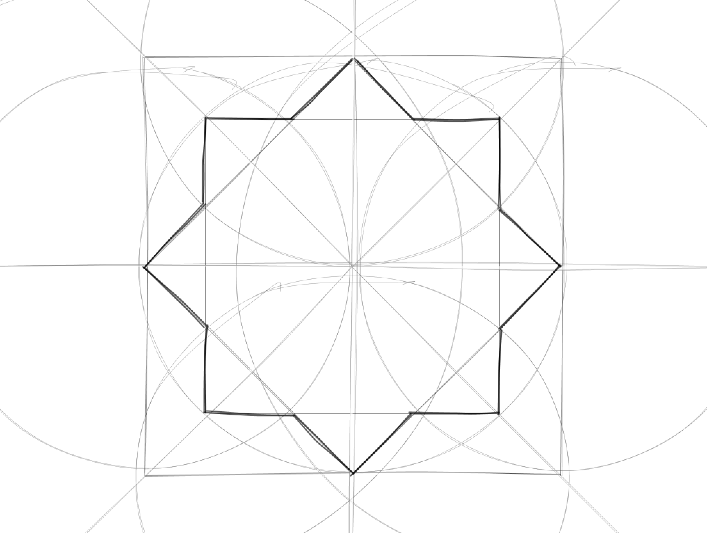

# symmetries
A study of Islamic geometric forms, created for/during a residency in Lahore, Pakistan. 

This is a self-running Processing application that explores the way in which Islamic geometric forms are created by hand, using the Handy library to render simulated sketches. 

