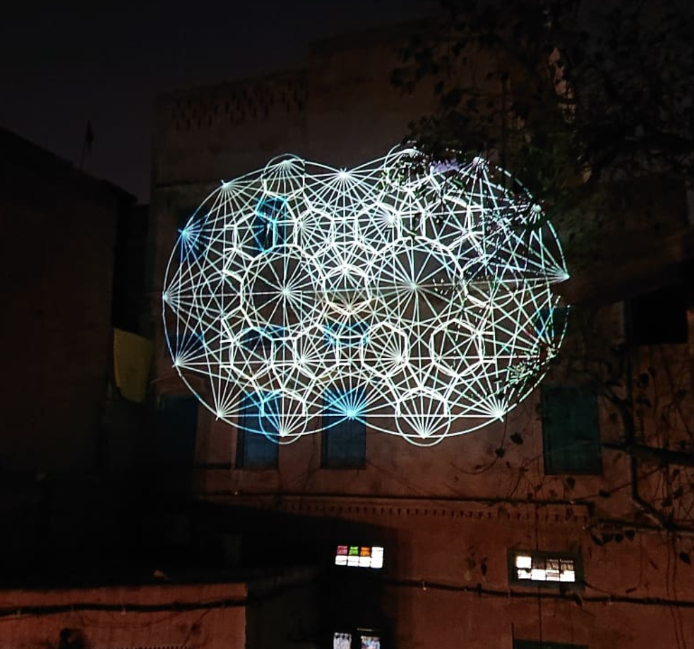

# THE MEASURE OF ALL THINGS
A study of Islamic geometric forms, created for/during the Sheherezade residency in Lahore, Pakistan, alongside Madlab.

This is a self-running Processing application that explores the way in which Islamic geometric forms are created by hand, using the Handy library to render simulated sketches. The software uses three layers of SVG imagery to simuate initial pencil sketches, pen overlays, and finally colour schemes. Both the illustrator files and resulting SVG's are included in this repository. 

It looks like this:

Here is a timelapse of it working, breaking, being fixed, and then working again: 
https://www.instagram.com/p/BvCqbTvHmeQ/

Here is a timelapse of it being turned on as the sun sets in Lahore: 
https://www.instagram.com/p/BvEntyXHsxB/

PLEASE NOTE this code is provided as-is, it's an absolute hot mess, such is the way when you write code in a massive hurry on a residency in a diffrent country on not enough sleep. I'm providing it for reference and learning and whatever else, and as such it is distributed under the extremely permissive/confrontation DO WHAT THE FUCK YOU WANT TO public license, see LICENSE.md for more information. 

Thanks! 